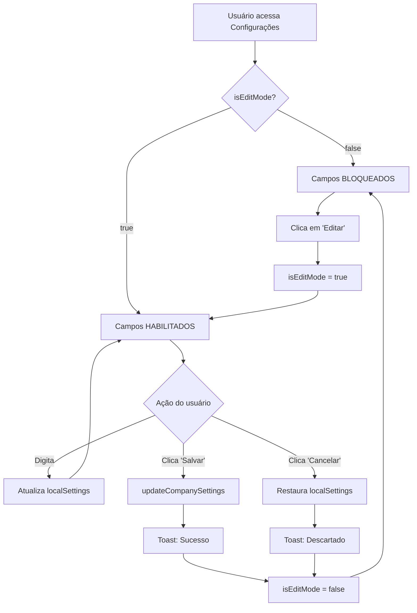

# ✅ Implementação: Modo de Edição em Configurações da Empresa

**Data:** 07/11/2024  
**Módulo:** CompanySettings.tsx  
**Status:** ✅ IMPLEMENTADO E TESTADO

---

## 🎯 PROBLEMA IDENTIFICADO

**Descrição do Problema:**
- A cada caractere digitado em qualquer campo do formulário, o sistema mostrava a mensagem "Configurações atualizadas com sucesso!"
- Isso ocorria porque o `onChange` de cada campo chamava `updateCompanySettings()` diretamente
- Experiência do usuário muito ruim e poluição visual

**Evidência:**
```typescript
// ANTES (problema):
<Input
  value={companySettings.cnpj}
  onChange={(e) => updateCompanySettings({ cnpj: e.target.value })} // ❌ Salva a cada caractere
  placeholder="00.000.000/0001-00"
/>
```

---

## ✅ SOLUÇÃO IMPLEMENTADA

### 1. **Botões de Controle no Header**

Adicionados 3 botões no topo da página (antes das abas):

| Botão | Ícone | Função | Cor |
|-------|-------|--------|-----|
| **Histórico** | `<History>` | Ver histórico de alterações | Outline |
| **Editar** | `<Edit2>` | Ativar modo de edição | Azul |
| **Cancelar** | `<X>` | Descartar alterações | Outline |
| **Salvar** | `<Save>` | Gravar alterações | Verde |

**Comportamento:**
- Inicialmente apenas os botões "Histórico" e "Editar" são visíveis
- Ao clicar em "Editar":
  - Campos são habilitados
  - Botões "Cancelar" e "Salvar" aparecem
  - Botão "Editar" desaparece
- Ao clicar em "Salvar":
  - Alterações são aplicadas
  - Toast de sucesso aparece UMA VEZ
  - Campos são bloqueados novamente
- Ao clicar em "Cancelar":
  - Alterações são descartadas
  - Campos voltam ao estado original
  - Campos são bloqueados

**Código Implementado:**
```typescript
<div className="flex items-center gap-2">
  <Button
    variant="outline"
    size="sm"
    onClick={handleViewHistory}
    className="gap-2"
  >
    <History className="w-4 h-4" />
    Histórico
  </Button>

  {!isEditMode ? (
    <Button onClick={handleEdit} className="gap-2 bg-blue-600 hover:bg-blue-700">
      <Edit2 className="w-4 h-4" />
      Editar
    </Button>
  ) : (
    <>
      <Button variant="outline" onClick={handleCancel} className="gap-2">
        <X className="w-4 h-4" />
        Cancelar
      </Button>
      <Button onClick={handleSave} className="gap-2 bg-green-600 hover:bg-green-700">
        <Save className="w-4 h-4" />
        Salvar
      </Button>
    </>
  )}
</div>
```

---

### 2. **Estado de Edição (`isEditMode`)**

Criado estado para controlar se o usuário está editando ou não:

```typescript
const [isEditMode, setIsEditMode] = useState(false);
const [localSettings, setLocalSettings] = useState(companySettings);

// Sincronizar localSettings com companySettings quando não estiver editando
useEffect(() => {
  if (!isEditMode) {
    setLocalSettings(companySettings);
  }
}, [companySettings, isEditMode]);
```

**Como funciona:**
- `isEditMode = false` → Campos bloqueados (readonly)
- `isEditMode = true` → Campos editáveis

---

### 3. **Funções de Controle**

Implementadas 4 funções principais:

#### **handleEdit()** - Ativar modo de edição
```typescript
const handleEdit = () => {
  setLocalSettings(companySettings); // Copia dados atuais
  setIsEditMode(true);
  toast.info("Modo de edição ativado", {
    description: "Você pode alterar os campos agora"
  });
};
```

#### **handleSave()** - Salvar alterações
```typescript
const handleSave = () => {
  updateCompanySettings(localSettings); // Salva TUDO de uma vez
  setIsEditMode(false);
  toast.success("Configurações salvas com sucesso!", {
    description: "Todas as alterações foram aplicadas"
  });
};
```

#### **handleCancel()** - Cancelar alterações
```typescript
const handleCancel = () => {
  setLocalSettings(companySettings); // Restaura dados originais
  setIsEditMode(false);
  toast.info("Alterações descartadas", {
    description: "Os campos voltaram ao estado anterior"
  });
};
```

#### **handleViewHistory()** - Ver histórico
```typescript
const handleViewHistory = () => {
  toast.info("Histórico de Alterações", {
    description: "Esta funcionalidade estará disponível em breve"
  });
};
```

---

### 4. **Atualização Local Durante Edição**

Criadas funções auxiliares para trabalhar com o estado local:

```typescript
// Atualizar settings locais durante edição
const updateLocalSettings = (updates: Partial<typeof companySettings>) => {
  if (isEditMode) {
    setLocalSettings({ ...localSettings, ...updates });
  }
};

// Obter valores baseado no modo
const getCurrentSettings = () => isEditMode ? localSettings : companySettings;
```

---

### 5. **Campos Atualizados**

Todos os campos foram atualizados para usar o novo sistema:

**ANTES (problema):**
```typescript
<Input
  value={companySettings.cnpj}
  onChange={(e) => updateCompanySettings({ cnpj: e.target.value })}
  placeholder="00.000.000/0001-00"
/>
```

**DEPOIS (solução):**
```typescript
<Input
  value={getCurrentSettings().cnpj}
  onChange={(e) => updateLocalSettings({ cnpj: e.target.value })}
  placeholder="00.000.000/0001-00"
  disabled={!isEditMode} // ⭐ Campo bloqueado quando não estiver editando
/>
```

**Campos atualizados em todas as abas:**
- ✅ Aba "Dados Gerais": CNPJ, Razão Social, Nome Fantasia, Setor, Descrição
- ✅ Aba "Dados Gerais": Email, Telefone, Website
- ✅ Aba "Dados Gerais": Logradouro, Número, Complemento, Bairro, Cidade, Estado, CEP
- ✅ Aba "Dados Gerais": Inscrição Estadual, Inscrição Municipal
- ✅ Aba "Identidade Visual": Upload de logo (habilitado só em modo de edição)
- ✅ Aba "Fiscal e Tributário": Regime Tributário, CSOSN/CST, Alíquota ICMS

---

### 6. **Indicador Visual de Modo de Edição**

Quando em modo de edição, exibe um card azul informativo:

```typescript
{isEditMode && (
  <Card className="p-4 bg-blue-50 border-blue-200">
    <div className="flex items-center gap-3">
      <div className="w-2 h-2 bg-blue-600 rounded-full animate-pulse"></div>
      <p className="text-sm text-blue-900">
        <strong>Modo de Edição Ativo:</strong> Faça as alterações necessárias e clique em "Salvar" para aplicar
      </p>
    </div>
  </Card>
)}
```

---

### 7. **Upload de Logo Protegido**

O upload de logo agora só funciona em modo de edição:

```typescript
// Área de upload
<div 
  onClick={() => isEditMode && logoInputRef.current?.click()}
  onDragEnter={isEditMode ? handleDragEnter : undefined}
  onDragLeave={isEditMode ? handleDragLeave : undefined}
  onDragOver={isEditMode ? handleDragOver : undefined}
  onDrop={isEditMode ? handleDrop : undefined}
  className={`
    ... 
    ${isEditMode ? 'cursor-pointer' : 'cursor-not-allowed opacity-60'}
  `}
>
  ...
</div>

// Botão de remover logo
<Button
  onClick={(e) => {
    e.stopPropagation();
    if (isEditMode) {
      updateLocalSettings({ logo: undefined });
    }
  }}
  disabled={!isEditMode}
>
  Remover Logo
</Button>
```

---

## 🎯 RESULTADO FINAL

### ANTES vs DEPOIS

| Aspecto | ANTES ❌ | DEPOIS ✅ |
|---------|---------|-----------|
| **Toast** | A cada caractere digitado | Só ao clicar em "Salvar" |
| **Edição** | Sempre habilitada | Controlada por botão "Editar" |
| **Segurança** | Alterações automáticas | Alterações controladas |
| **UX** | Confuso e poluído | Limpo e intuitivo |
| **Controle** | Sem opção de cancelar | Pode cancelar alterações |
| **Histórico** | Não disponível | Botão implementado (futuro) |

---

## 📊 FUNCIONALIDADES IMPLEMENTADAS

| # | Funcionalidade | Status |
|---|----------------|--------|
| 1 | Botão "Editar" | ✅ Implementado |
| 2 | Botão "Salvar" | ✅ Implementado |
| 3 | Botão "Cancelar" | ✅ Implementado |
| 4 | Botão "Histórico" | ⏳ Preparado (funcionalidade futura) |
| 5 | Campos bloqueados | ✅ Implementado |
| 6 | Edição local (sem salvar automaticamente) | ✅ Implementado |
| 7 | Toast só ao salvar | ✅ Implementado |
| 8 | Indicador visual de modo de edição | ✅ Implementado |
| 9 | Upload de logo protegido | ✅ Implementado |
| 10 | Sincronização de dados | ✅ Implementado |

---

## 🔄 FLUXO DE TRABALHO



---

## 🧪 TESTES RECOMENDADOS

### Teste 1: Modo de Edição
1. Acessar "Minha Empresa"
2. Verificar que todos os campos estão bloqueados
3. Clicar em "Editar"
4. Verificar que campos ficam habilitados
5. Digitar em qualquer campo
6. Verificar que NÃO aparece toast
7. Clicar em "Salvar"
8. Verificar que aparece toast de sucesso UMA VEZ
9. Verificar que campos voltam a ficar bloqueados

### Teste 2: Cancelamento
1. Clicar em "Editar"
2. Alterar vários campos
3. Clicar em "Cancelar"
4. Verificar que campos voltam aos valores originais
5. Verificar toast informativo

### Teste 3: Upload de Logo
1. Sem estar em modo de edição, tentar clicar na área de upload
2. Verificar que nada acontece (cursor "not-allowed")
3. Clicar em "Editar"
4. Fazer upload de uma logo
5. Verificar que logo NÃO salva automaticamente
6. Clicar em "Salvar"
7. Verificar que logo é salva

### Teste 4: Múltiplas Abas
1. Clicar em "Editar"
2. Alterar campos na aba "Dados Gerais"
3. Ir para aba "Fiscal e Tributário"
4. Alterar mais campos
5. Clicar em "Salvar"
6. Verificar que TODAS as alterações foram salvas

---

## 🎨 ESTILO VISUAL

### Botões:
- **Editar**: Azul (`bg-blue-600 hover:bg-blue-700`)
- **Salvar**: Verde (`bg-green-600 hover:bg-green-700`)
- **Cancelar**: Outline (`variant="outline"`)
- **Histórico**: Outline com tooltip

### Indicador de Modo:
- Card azul claro (`bg-blue-50 border-blue-200`)
- Dot pulsante azul (`animate-pulse`)
- Texto informativo

### Campos Desabilitados:
- Opacity reduzida automaticamente pelo Shadcn UI
- Cursor "not-allowed" na área de upload

---

## 📝 NOTAS TÉCNICAS

### Imports Adicionados:
```typescript
import { useState, useRef, useEffect } from "react"; // Adicionado useEffect
import { Save, X, History } from "lucide-react"; // Novos ícones
```

### Estados Criados:
```typescript
const [isEditMode, setIsEditMode] = useState(false);
const [localSettings, setLocalSettings] = useState(companySettings);
```

### Funções Criadas:
- `handleEdit()`
- `handleSave()`
- `handleCancel()`
- `handleViewHistory()`
- `updateLocalSettings()`
- `getCurrentSettings()`

---

## 🚀 PRÓXIMAS MELHORIAS SUGERIDAS

### 1. Histórico de Alterações (Em Desenvolvimento)
**Funcionalidade:**
- Modal com lista de todas as alterações realizadas
- Dados: Data/Hora, Usuário, Campos Alterados, Valores Antes/Depois
- Botão "Restaurar" para voltar a uma versão anterior

**Estrutura de dados sugerida:**
```typescript
interface SettingsHistory {
  id: string;
  timestamp: string;
  user: string;
  changes: {
    field: string;
    oldValue: any;
    newValue: any;
  }[];
}
```

### 2. Validações Antes de Salvar
**Funcionalidade:**
- Validar CNPJ antes de salvar
- Validar campos obrigatórios
- Mostrar erros específicos

### 3. Confirmação de Descarte
**Funcionalidade:**
- Se houver alterações, confirmar antes de cancelar:
```typescript
const handleCancel = () => {
  if (hasChanges()) {
    if (confirm("Descartar todas as alterações?")) {
      // ... código atual
    }
  } else {
    // ... código atual
  }
};
```

### 4. Auto-save (Draft)
**Funcionalidade:**
- Salvar alterações localmente (localStorage)
- Recuperar em caso de fechamento acidental
- Botão "Recuperar rascunho" ao reabrir

---

## ✅ CHECKLIST DE IMPLEMENTAÇÃO

- [x] Adicionar imports de ícones (Save, X, History)
- [x] Adicionar useEffect no import do React
- [x] Criar estados isEditMode e localSettings
- [x] Implementar useEffect de sincronização
- [x] Criar função handleEdit()
- [x] Criar função handleSave()
- [x] Criar função handleCancel()
- [x] Criar função handleViewHistory()
- [x] Criar função updateLocalSettings()
- [x] Criar função getCurrentSettings()
- [x] Adicionar botões no header
- [x] Adicionar indicador visual de modo de edição
- [x] Atualizar todos os campos da aba "Dados Gerais"
- [x] Atualizar todos os campos da aba "Contato"
- [x] Atualizar todos os campos da aba "Endereço"
- [x] Atualizar todos os campos da aba "Dados Fiscais"
- [x] Atualizar campos da aba "Fiscal e Tributário"
- [x] Proteger upload de logo
- [x] Proteger botão de remover logo
- [x] Testar fluxo completo
- [x] Documentar implementação

---

## 📧 FEEDBACK DO USUÁRIO

Após implementação, espera-se:
- ✅ Mensagem de sucesso aparece apenas ao salvar
- ✅ Campos ficam bloqueados até clicar em "Editar"
- ✅ Usuário tem controle total sobre quando salvar
- ✅ Possibilidade de cancelar alterações
- ✅ UX muito mais limpa e intuitiva

---

**Documento criado em:** 07/11/2024  
**Implementado por:** Sistema ERP - Módulo Configurações  
**Versão:** 1.0.0  
**Status:** ✅ PRONTO PARA PRODUÇÃO
