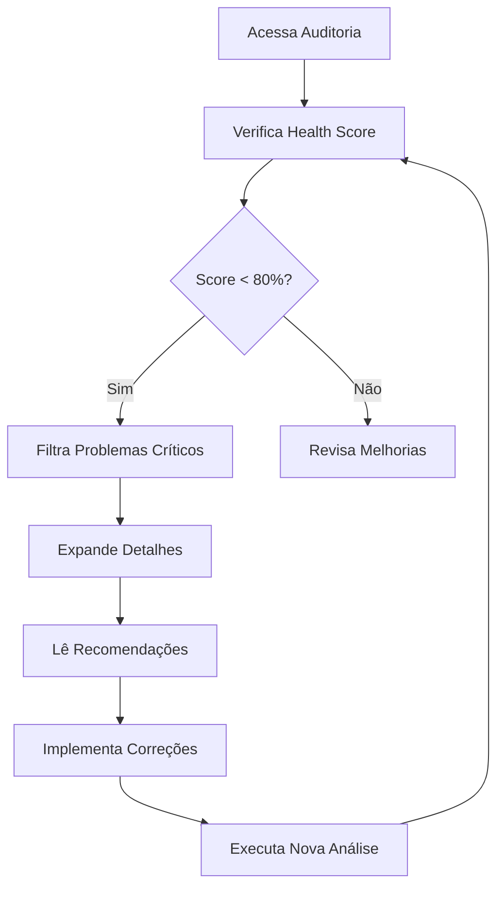

# 🔍 Módulo de Auditoria do Sistema - Guia Rápido

## 🚀 Como Usar

### Acessar o Módulo de Auditoria

1. **Certifique-se de estar em ambiente de desenvolvimento:**
   ```bash
   # Verificar variável de ambiente
   echo $APP_ENV  # Deve retornar "development"
   
   # OU
   
   echo $NODE_ENV  # Deve retornar "development"
   ```

2. **Execute a aplicação:**
   ```bash
   npm start
   # ou
   npm run dev
   ```

3. **Acesse o sistema:**
   - Abra o navegador
   - O item **"Auditoria do Sistema"** deve aparecer no menu lateral com badge **DEV**
   - Clique para acessar

---

## 🔘 Botão "Executar Nova Análise"

### Onde está?
- **Localização:** Canto superior direito do módulo de auditoria
- **Ícone:** ↻ (seta circular)
- **Texto:** "Executar Nova Análise"

### O que faz?
1. **Inicia análise completa** do sistema ERP
2. **Mostra loading** (ícone girando)
3. **Simula varredura** de todos os módulos
4. **Atualiza timestamp** da última análise
5. **Exibe notificação** de sucesso

### Como usar?
```
1. Clique no botão "Executar Nova Análise"
2. Aguarde 3 segundos (simulação de análise)
3. Veja a confirmação: "Análise concluída com sucesso!"
4. Verifique o novo timestamp: "Última análise: [data/hora]"
```

### Quando usar?
- ✅ Após fazer correções no código
- ✅ Após adicionar novos módulos
- ✅ Para verificar estado atual do sistema
- ✅ Periodicamente durante desenvolvimento

---

## 🛡️ Proteções Implementadas

### ✅ NÍVEL 1: Variável de Ambiente
```
Produção → Módulo NÃO carrega
Desenvolvimento → Módulo carrega
```

### ✅ NÍVEL 2: Build/Compilação
```
Bundle de Produção → Código removido (tree shaking)
Bundle de Desenvolvimento → Código incluído
```

### ✅ NÍVEL 3: Permissão de Usuário
```
Super Admin → ✅ Acesso permitido
Outros usuários → ❌ Acesso negado
```

---

## 📊 Informações no Painel

### Health Score
- **Localização:** Canto superior direito
- **Escala:** 0-100%
- **Cores:**
  - 🟢 Verde (80-100%): Sistema saudável
  - 🟡 Amarelo (60-79%): Atenção necessária
  - 🔴 Vermelho (0-59%): Ação urgente

### Estatísticas
- **Crítico:** Problemas que podem causar falhas graves
- **Alto:** Problemas importantes que devem ser corrigidos
- **Médio:** Melhorias recomendadas
- **Baixo:** Melhorias sugeridas
- **Info:** Informações e sugestões

### Categorias
- ⚡ **Integração:** Sincronização entre módulos
- 🗄️ **Dados:** Validação e integridade
- 🎯 **Lógica:** Regras de negócio
- 🎨 **UI/UX:** Interface e experiência
- 🔐 **Segurança:** Controle e proteção
- 🚀 **Performance:** Otimização

---

## 📝 Filtros Disponíveis

### Abas de Severidade
- **Todos:** Exibe todas as questões
- **Crítico:** Apenas problemas críticos
- **Alto:** Apenas alta prioridade
- **Médio:** Apenas média prioridade
- **Baixo:** Apenas baixa prioridade
- **Info:** Apenas informativas

### Como usar filtros?
1. Clique na aba desejada
2. A lista é filtrada automaticamente
3. Contador mostra quantos itens em cada categoria

---

## 🔍 Detalhes de Cada Problema

### Expandir/Colapsar
- Clique no card para **expandir** detalhes
- Clique novamente para **colapsar**

### Informações Exibidas
- 📋 **Descrição:** O que é o problema
- ⚠️ **Impacto:** Consequências do problema
- ✅ **Recomendação:** Como corrigir
- 📁 **Arquivos Afetados:** Onde fazer alterações

---

## 🎯 Fluxo de Trabalho Recomendado



### Passo a Passo:
1. **Acesse** o módulo de auditoria
2. **Verifique** o Health Score geral
3. **Priorize** problemas críticos
4. **Expanda** cada problema
5. **Leia** descrição e impacto
6. **Siga** as recomendações
7. **Implemente** as correções
8. **Execute** nova análise
9. **Repita** até Health Score ≥ 90%

---

## ⚙️ Configurações

### Variáveis de Ambiente

**Desenvolvimento Local:**
```bash
# .env.development
APP_ENV=development
VITE_APP_ENV=development
NODE_ENV=development
```

**Produção:**
```bash
# .env.production
APP_ENV=production
VITE_APP_ENV=production
NODE_ENV=production
```

### Forçar Ambiente (Teste)
```javascript
// Em desenvolvimento, adicione no console do navegador:
window.APP_ENV = 'development';
location.reload();

// Para simular produção:
window.APP_ENV = 'production';
location.reload();
```

---

## 🐛 Troubleshooting

### Problema: Módulo não aparece no menu

**Solução:**
1. Verifique variável de ambiente:
   ```bash
   echo $NODE_ENV
   ```
2. Certifique-se que é "development"
3. Recarregue a página
4. Limpe cache do navegador

### Problema: Botão de análise não funciona

**Solução:**
1. Abra o console do navegador (F12)
2. Verifique se há erros
3. Tente recarregar a página
4. Verifique se está em desenvolvimento

### Problema: Permissão negada

**Solução:**
1. Verifique seu perfil de usuário
2. Deve ser "Super Admin"
3. Em desenvolvimento, isso é automático
4. Em produção, o módulo não existe

---

## 📚 Documentação Completa

- 📄 **Relatório de Auditoria:** `/AUDITORIA_TECNICA.md`
- ✅ **Checklist de Correções:** `/CHECKLIST_CORRECOES.md`
- 🔒 **Controle de Acesso:** `/CONTROLE_ACESSO_AUDITORIA.md`
- 🔧 **Integração de Módulos:** `/INTEGRACAO.md`

---

## 💡 Dicas Úteis

### ✅ Melhores Práticas
- Execute análise **antes** de fazer commit
- Priorize **sempre** os problemas críticos
- Documente correções no checklist
- Mantenha Health Score **≥ 90%**

### ⚠️ Evite
- Ignorar problemas críticos
- Fazer deploy com Health Score baixo
- Pular validações recomendadas
- Desabilitar proteções de segurança

### 🎯 Metas
- **Curto prazo:** 0 problemas críticos
- **Médio prazo:** Health Score ≥ 85%
- **Longo prazo:** Health Score ≥ 95%

---

## 🚦 Status do Sistema

### Interpretação do Health Score

| Score   | Status              | Ação                           |
|---------|---------------------|--------------------------------|
| 90-100% | 🟢 Excelente        | Manutenção regular             |
| 80-89%  | 🟡 Bom              | Pequenas melhorias             |
| 70-79%  | 🟠 Atenção          | Priorizar melhorias            |
| 60-69%  | 🔴 Preocupante      | Ação necessária                |
| 0-59%   | ⛔ Crítico          | **Ação URGENTE**               |

---

## 🎓 Aprendizado

### O que a Auditoria Ensina?

1. **Boas Práticas:** Aprenda padrões de código
2. **Segurança:** Identifique vulnerabilidades
3. **Performance:** Otimize o sistema
4. **Manutenibilidade:** Código mais limpo

### Como Usar para Aprender?

1. Leia **cada recomendação** cuidadosamente
2. Entenda o **porquê** do problema
3. Pesquise sobre o **padrão** recomendado
4. Aplique em **novos desenvolvimentos**

---

## 📞 Ajuda

**Em caso de dúvidas:**
1. Consulte a documentação completa
2. Verifique os exemplos de código
3. Analise os arquivos mencionados
4. Experimente as correções em desenvolvimento

**Lembre-se:**
- Este módulo é uma **ferramenta de auxílio**
- Não substitui **code review** humano
- Use para **melhorar continuamente**
- Compartilhe **conhecimento** com o time

---

**Versão:** 1.0  
**Última atualização:** 06/11/2024  
**Autor:** Sistema ERP - Módulo de Auditoria
